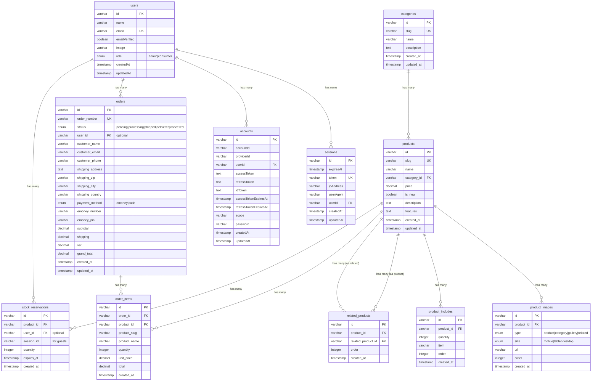

# 資料庫設計文檔

## 概述

本專案使用 **Drizzle ORM** + **PostgreSQL** + **Better Auth** 來替代原本的 `data.json` 假資料。資料庫設計支援完整的電商功能，包括：

- **認證系統**：使用 Better Auth 管理用戶認證（支援 admin 和 consumer 角色）
- **商品管理**：完整的商品目錄系統
- **訂單處理**：支援登入用戶和訪客結帳
- **圖片管理**：多尺寸、多類型的圖片儲存

## 資料庫架構圖

### 關聯關係圖



### 簡化架構樹狀圖

```
categories (分類)
  └─ products (商品)
      ├─ product_images (商品圖片)
      ├─ product_includes (包裝內容)
      ├─ related_products (相關商品 - 自關聯)
      └─ order_items (訂單項目)
            └─ orders (訂單)
```

## 表格詳細設計

### Better Auth 表格

#### 1. user（用戶表）

| 欄位          | 類型         | 說明                                           |
| ------------- | ------------ | ---------------------------------------------- |
| id            | varchar(255) | 主鍵                                           |
| name          | varchar(255) | 用戶名稱                                       |
| email         | varchar(255) | 電子郵件（唯一）                               |
| emailVerified | boolean      | 電子郵件是否已驗證                             |
| image         | varchar(500) | 用戶頭像 URL（可選）                           |
| role          | enum         | 用戶角色：admin（管理者）或 consumer（消費者） |
| createdAt     | timestamp    | 建立時間                                       |
| updatedAt     | timestamp    | 更新時間                                       |

**角色說明**:

- `admin` - 後台管理者，可管理商品、訂單等
- `consumer` - 一般消費者，可瀏覽商品、下單

#### 2. session（會話表）

| 欄位      | 類型         | 說明               |
| --------- | ------------ | ------------------ |
| id        | varchar(255) | 主鍵               |
| expiresAt | timestamp    | 過期時間           |
| token     | varchar(255) | 會話 token（唯一） |
| ipAddress | varchar(255) | IP 地址（可選）    |
| userAgent | varchar(500) | 用戶代理（可選）   |
| userId    | varchar(255) | 用戶 ID（外鍵）    |
| createdAt | timestamp    | 建立時間           |
| updatedAt | timestamp    | 更新時間           |

#### 3. account（帳號表）

| 欄位                  | 類型         | 說明                               |
| --------------------- | ------------ | ---------------------------------- |
| id                    | varchar(255) | 主鍵                               |
| accountId             | varchar(255) | 第三方帳號 ID                      |
| providerId            | varchar(255) | 提供者 ID（如 "github", "google"） |
| userId                | varchar(255) | 用戶 ID（外鍵）                    |
| accessToken           | text         | 存取 token（OAuth）                |
| refreshToken          | text         | 刷新 token（OAuth）                |
| idToken               | text         | ID token（OAuth）                  |
| accessTokenExpiresAt  | timestamp    | 存取 token 過期時間                |
| refreshTokenExpiresAt | timestamp    | 刷新 token 過期時間                |
| scope                 | varchar(500) | OAuth 權限範圍                     |
| password              | varchar(255) | 密碼雜湊（email/password 認證）    |
| createdAt             | timestamp    | 建立時間                           |
| updatedAt             | timestamp    | 更新時間                           |

#### 4. verification（驗證表）

| 欄位       | 類型         | 說明               |
| ---------- | ------------ | ------------------ |
| id         | varchar(255) | 主鍵               |
| identifier | varchar(255) | 識別符（email 等） |
| value      | varchar(255) | 驗證碼或 token     |
| expiresAt  | timestamp    | 過期時間           |
| createdAt  | timestamp    | 建立時間           |
| updatedAt  | timestamp    | 更新時間           |

用於：

- 電子郵件驗證
- 密碼重置
- 其他一次性驗證流程

### 電商表格

#### 5. categories（分類表）

| 欄位        | 類型         | 說明              |
| ----------- | ------------ | ----------------- |
| id          | varchar(128) | 主鍵，CUID2       |
| slug        | varchar(255) | 分類 slug（唯一） |
| name        | varchar(255) | 分類名稱          |
| description | text         | 分類描述（可選）  |
| created_at  | timestamp    | 建立時間          |
| updated_at  | timestamp    | 更新時間          |

**分類類型**（enum）:

- `headphones`
- `speakers`
- `earphones`

#### 6. products（商品表）

| 欄位        | 類型          | 說明              |
| ----------- | ------------- | ----------------- |
| id          | varchar(128)  | 主鍵，CUID2       |
| slug        | varchar(255)  | 商品 slug（唯一） |
| name        | varchar(255)  | 商品名稱          |
| category_id | varchar(128)  | 分類 ID（外鍵）   |
| price       | decimal(10,2) | 價格              |
| stock       | integer       | 庫存數量（>= 0）  |
| is_new      | boolean       | 是否為新品        |
| description | text          | 商品描述          |
| features    | text          | 商品特色說明      |
| created_at  | timestamp     | 建立時間          |
| updated_at  | timestamp     | 更新時間          |

#### 7. product_images（商品圖片表）

| 欄位       | 類型         | 說明                       |
| ---------- | ------------ | -------------------------- |
| id         | varchar(128) | 主鍵，CUID2                |
| product_id | varchar(128) | 商品 ID（外鍵）            |
| type       | enum         | 圖片類型                   |
| size       | enum         | 圖片尺寸                   |
| url        | varchar(500) | 圖片 URL（Vercel Blob/R2） |
| order      | integer      | 排序順序                   |
| created_at | timestamp    | 建立時間                   |

**圖片類型**（enum）:

- `product` - 商品主圖
- `category` - 分類頁預覽圖
- `gallery` - 商品圖庫
- `related` - 相關商品圖

**圖片尺寸**（enum）:

- `mobile`
- `tablet`
- `desktop`

#### 8. product_includes（商品包含項目表）

| 欄位       | 類型         | 說明            |
| ---------- | ------------ | --------------- |
| id         | varchar(128) | 主鍵，CUID2     |
| product_id | varchar(128) | 商品 ID（外鍵） |
| quantity   | integer      | 數量            |
| item       | varchar(255) | 項目名稱        |
| order      | integer      | 排序順序        |
| created_at | timestamp    | 建立時間        |

#### 9. related_products（相關商品表）

| 欄位               | 類型         | 說明                |
| ------------------ | ------------ | ------------------- |
| id                 | varchar(128) | 主鍵，CUID2         |
| product_id         | varchar(128) | 商品 ID（外鍵）     |
| related_product_id | varchar(128) | 相關商品 ID（外鍵） |
| order              | integer      | 排序順序            |
| created_at         | timestamp    | 建立時間            |

#### 10. orders（訂單表）

| 欄位             | 類型          | 說明                                 |
| ---------------- | ------------- | ------------------------------------ |
| id               | varchar(128)  | 主鍵，CUID2                          |
| order_number     | varchar(50)   | 訂單編號（唯一）                     |
| status           | enum          | 訂單狀態                             |
| user_id          | varchar(255)  | 用戶 ID（外鍵，可選 - 支援訪客結帳） |
| customer_name    | varchar(255)  | 客戶姓名                             |
| customer_email   | varchar(255)  | 客戶郵件                             |
| customer_phone   | varchar(50)   | 客戶電話（可選）                     |
| shipping_address | text          | 配送地址                             |
| shipping_zip     | varchar(20)   | 郵遞區號                             |
| shipping_city    | varchar(255)  | 城市                                 |
| shipping_country | varchar(100)  | 國家                                 |
| payment_method   | enum          | 付款方式                             |
| emoney_number    | varchar(255)  | e-Money 帳號（可選）                 |
| emoney_pin       | varchar(50)   | e-Money PIN（可選）                  |
| subtotal         | decimal(10,2) | 小計                                 |
| shipping         | decimal(10,2) | 運費                                 |
| vat              | decimal(10,2) | 稅金                                 |
| grand_total      | decimal(10,2) | 總額                                 |
| created_at       | timestamp     | 建立時間                             |
| updated_at       | timestamp     | 更新時間                             |

**訂單狀態**（enum）:

- `pending` - 待處理
- `processing` - 處理中
- `shipped` - 已出貨
- `delivered` - 已送達
- `cancelled` - 已取消

**付款方式**（enum）:

- `emoney` - 電子錢包
- `cash` - 貨到付款

#### 11. order_items（訂單項目表）

| 欄位         | 類型          | 說明              |
| ------------ | ------------- | ----------------- |
| id           | varchar(128)  | 主鍵，CUID2       |
| order_id     | varchar(128)  | 訂單 ID（外鍵）   |
| product_id   | varchar(128)  | 商品 ID（外鍵）   |
| product_slug | varchar(255)  | 商品 slug（快照） |
| product_name | varchar(255)  | 商品名稱（快照）  |
| quantity     | integer       | 數量              |
| unit_price   | decimal(10,2) | 單價（快照）      |
| total        | decimal(10,2) | 小計              |
| created_at   | timestamp     | 建立時間          |

**注意**: `product_slug`, `product_name`, `unit_price` 是快照資料，確保歷史訂單不受商品變更影響。

#### 12. stock_reservations（庫存預留表）

| 欄位       | 類型         | 說明                                              |
| ---------- | ------------ | ------------------------------------------------- |
| id         | varchar(128) | 主鍵，CUID2                                       |
| product_id | varchar(128) | 商品 ID（外鍵）                                   |
| user_id    | varchar(255) | 用戶 ID（外鍵，可選 - 登入用戶）                  |
| session_id | varchar(255) | 會話 ID（可選 - 訪客用戶的 localStorage session） |
| quantity   | integer      | 預留數量                                          |
| expires_at | timestamp    | 過期時間（建立後 30 分鐘）                        |
| created_at | timestamp    | 建立時間                                          |

**用途**：

- 當商品加入購物車時，建立庫存預留記錄
- 預留時間為 30 分鐘，過期後自動釋放
- 支援登入用戶（使用 `user_id`）和訪客（使用 `session_id`）
- 結帳成功後，預留會轉換為實際訂單，並從 `products.stock` 扣除

**庫存計算**：

```sql
-- 可用庫存 = 總庫存 - 已預留且未過期的數量
available_stock = products.stock - COALESCE(
  SUM(stock_reservations.quantity)
  WHERE stock_reservations.product_id = products.id
    AND stock_reservations.expires_at > NOW(),
  0
)
```

如果 `available_stock < 0` 或 `available_stock < 購買數量`，商品無法購買。

## 關聯關係

### Better Auth 關聯

1. **users** → **sessions** (一對多)
2. **users** → **accounts** (一對多)
3. **users** → **orders** (一對多，可選)

### 電商關聯

4. **categories** → **products** (一對多)
5. **products** → **product_images** (一對多)
6. **products** → **product_includes** (一對多)
7. **products** → **related_products** (自關聯，多對多)
8. **orders** → **order_items** (一對多)
9. **products** → **order_items** (一對多)
10. **products** → **stock_reservations** (一對多)
11. **users** → **stock_reservations** (一對多，可選)

## 索引策略

### 基礎索引

- `categories.slug` - 唯一索引
- `products.slug` - 唯一索引
- `products.category_id` - 外鍵索引
- `product_images.product_id` - 外鍵索引
- `orders.order_number` - 唯一索引
- `order_items.order_id` - 外鍵索引
- `order_items.product_id` - 外鍵索引

### 庫存管理索引

- `stock_reservations.product_id` - 外鍵索引
- `stock_reservations.user_id` - 外鍵索引（可選）
- `stock_reservations.expires_at` - 索引（用於清理過期預留）
- `stock_reservations.product_id + expires_at` - 複合索引（用於庫存查詢）
- `stock_reservations.product_id` - 外鍵索引
- `stock_reservations.user_id` - 外鍵索引（可選）
- `stock_reservations.expires_at` - 索引（用於清理過期預留）
- `stock_reservations.product_id + expires_at` - 複合索引（用於庫存查詢）

## 認證與授權

### 用戶角色

- **admin（管理者）**：

  - 可存取後台管理介面
  - 可管理商品、分類、訂單
  - 可查看所有用戶訂單

- **consumer（消費者）**：
  - 可瀏覽商品
  - 可下單購買
  - 可查看自己的訂單歷史

### Better Auth 整合

Better Auth 提供：

- Email/Password 認證
- OAuth 2.0 支援（GitHub, Google, Discord 等）
- Session 管理
- Email 驗證
- 密碼重置

## 資料遷移策略

### 從 data.json 遷移

seed script (`database/seed.ts`) 會：

1. 清除現有資料
2. 從 `data.json` 讀取資料
3. 建立分類
4. 建立商品
5. 建立商品圖片（所有尺寸和類型）
6. 建立商品包含項目
7. 建立相關商品關聯

### 建立初始管理員

需要手動建立或透過 seed script 建立初始管理員帳號：

```typescript
// 在 seed.ts 或單獨的 admin seed script 中
await db.insert(users).values({
  id: createId(),
  name: "Admin",
  email: "admin@example.com",
  emailVerified: true,
  role: "admin",
  // password 會由 Better Auth 處理
});
```

## API 端點對應

### Products API

- `GET /api/products` → 查詢所有商品
- `GET /api/products/:slug` → 查詢單一商品
- `GET /api/products/category/:category` → 依分類查詢

### Cart API

- `GET /api/cart` → 計算購物車（目前仍使用 localStorage，未來可改為資料庫）

### Checkout API

- `POST /api/checkout` → 建立訂單

### Admin API（需要 admin 角色）

- `GET /api/admin/products` → 管理商品
- `GET /api/admin/categories` → 管理分類
- `GET /api/admin/orders` → 管理訂單
- `GET /api/admin/users` → 管理用戶（未來）

### Auth API（Better Auth）

- `POST /api/auth/sign-up` → 註冊
- `POST /api/auth/sign-in` → 登入
- `POST /api/auth/sign-out` → 登出
- `GET /api/auth/session` → 取得當前會話
- `POST /api/auth/forgot-password` → 忘記密碼
- `POST /api/auth/reset-password` → 重置密碼

## 下一步

1. ✅ 資料庫 schema 設計（包含 Better Auth）
2. ✅ Docker Compose 配置
3. ✅ Seed script
4. ⏳ 設置 Better Auth 配置檔案
5. ⏳ 建立認證 middleware
6. ⏳ 替換 Products API 端點
7. ⏳ 替換 Checkout API 端點（支援登入用戶和訪客）
8. ⏳ 替換 Admin API 端點（加入角色檢查）
9. ⏳ 建立用戶訂單歷史 API
